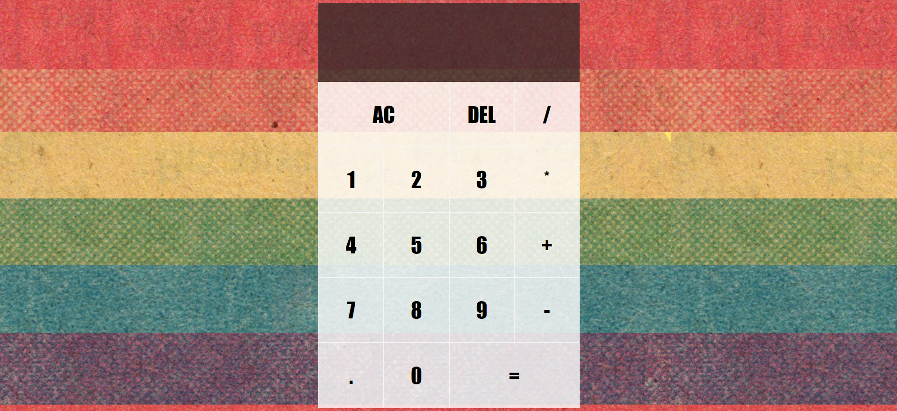

# Calculator

A simple calculator AKA  "queerculator" built using HTML, CSS and JavaScript
Submitted to MLH INIT Hackathon

## Deployed Link
 [Queerculator](https://shivanshi-s.github.io/Calculator/)
 
 ## Screenshot
 

## Connect on Social Media 
<!-- 
 -->
<a href="https://twitter.com/whatshivanshi">
  </img> &nbsp;&nbsp;
 <a href="https://linkedin.com/in/shivanshi-saxena12">
  </img>
<!-- 
 -->
